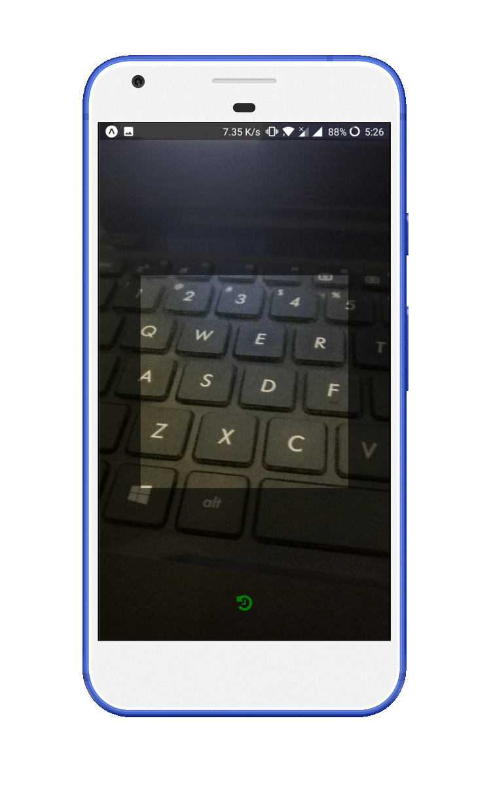
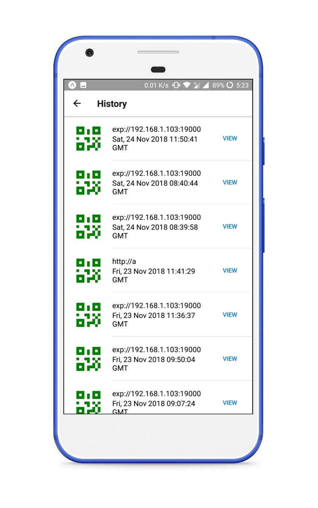

# QR Scanner

A React Native QR code scanner app built using Expo.

## Application preview

### Features

- Scans the QR code with the device camera.
- Stores the scanned QR code locally in SQLite.
- User can check the previously scanned QR codes at any time by clicking on the History Icon.

## Contributing

If you are interested in extending/improving this application in any way then raise a new issue and fill out the details in the description. We can write the v2 of the article mentioning all these changes.

## Tutorial

I have written detailed tutorial on how to create this app on Medium. If you are interested in learning it then check out the tutorial [here]().

### Braches

Refere to below desciption to choose the branch,

- master: code for QR Scanner v1.0.0
- v0.3.0: code for QR Scanner v0.3.0
- v0.4.0: code for QR Scanner v0.4.0
